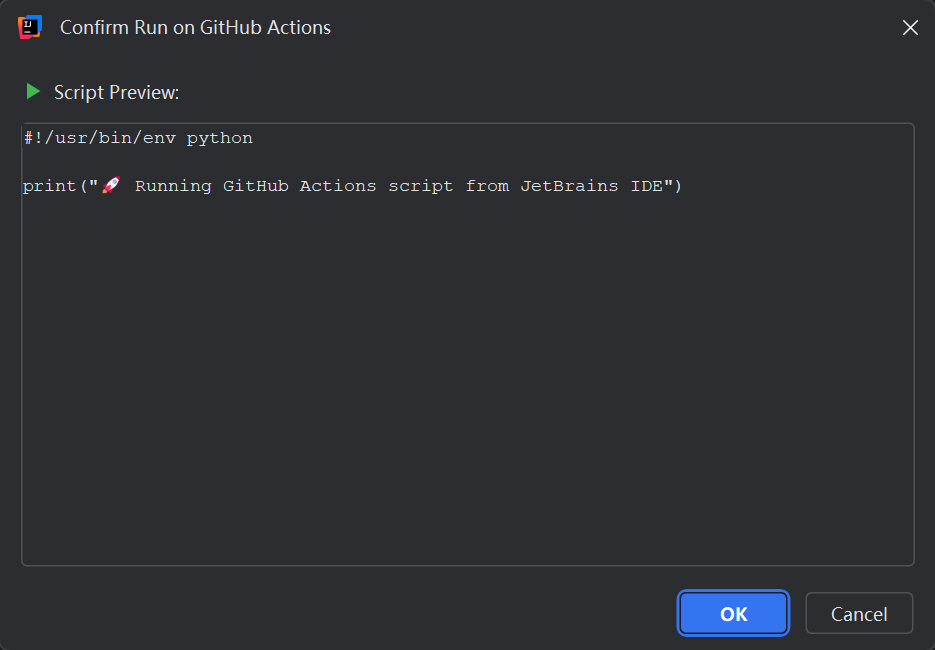
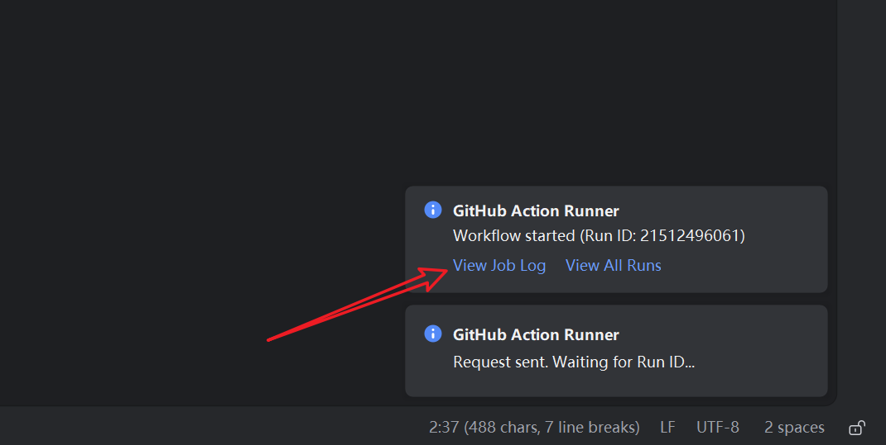

# Runner for GitHub Actions

<!-- Plugin description -->
[](https://plugins.jetbrains.com/plugin/29981-runner-for-github-actions)
[](https://plugins.jetbrains.com/plugin/29981-runner-for-github-actions)
[](https://github.com/foyoux/github-action-runner)

Run selected scripts (or files) directly on GitHub Actions from your JetBrains IDE.

Ideal for tasks requiring high bandwidth (e.g., Docker image mirroring), specific Linux environments, or when you just need a clean cloud environment to run a snippet of code.

## ✨ Features

- **Execute Selection**: Select any text (Shell, Python, Node.js, etc.) in the editor and run it instantly.
- **Execute File**: Right-click any file to run its content.
- **Cloud Runner UI**: Beautiful "Cloud Runner" icons and confirmation dialogs.
- **Free Disk Space**: One-click option to free up disk space on the GitHub Runner before execution.
- **Secure Configuration**: GitHub Token is stored safely using the IDE's Credential Store.
- **Smart Feedback**: Real-time notifications with direct links to live GitHub Job logs.
<!-- Plugin description end -->

## 📸 Screenshots

| Context Menu | Confirm Dialog |
| :---: | :---: |
|  |  |
| *Right-click to run selection or file* | *Preview content before triggering* |

## 🚀 Getting Started

### 1. Installation

1. Open **Settings/Preferences** > **Plugins** > **Marketplace**.
2. Search for "**Runner for GitHub Actions**" and install.

### 2. Workflow Setup

Create a file named `.github/workflows/jetbrains-runner.yml` in your target repository:

```yaml
name: JetBrains Runner

on:
  workflow_dispatch:
    inputs:
      runs-on:
        description: 'Runner System Type'
        type: string
        required: false
        default: 'ubuntu-22.04'
      free-space:
        description: 'Free Disk Space'
        type: boolean
        required: false
        default: false
      script:
        description: 'Base64 Encoded Script'
        type: string
        required: true
      gzip:
        description: 'Is Gzipped (Implies Base64+Gzip)'
        type: boolean
        required: false
        default: false

jobs:
  remote-execution:
    runs-on: ${{ inputs.runs-on }}
    steps:
      - name: Free Disk Space
        if: ${{ inputs.free-space }}
        uses: jlumbroso/free-disk-space@main
        with:
          tool-cache: false
          android: true
          dotnet: true
          haskell: true
          large-packages: true
          docker-images: true
          swap-storage: true

      - name: Execute Script
        run: |
          # 🚀 Runner for GitHub Actions
          
          # 1. Save input to file
          printf '%s' "${{ inputs.script }}" > input_b64
          
          # 2. Decode Base64 (Always required to preserve newlines/formatting)
          base64 -d input_b64 > decoded_raw
          
          # 3. Decompress Gzip if enabled
          if [ "${{ inputs.gzip }}" == "true" ]; then
            gunzip < decoded_raw > script.sh
          else
            mv decoded_raw script.sh
          fi

          # 4. Execute
          chmod +x script.sh
          ./script.sh
```

### 3. Configuration

Go to **Settings/Preferences** > **Tools** > **Runner for GitHub Actions**.


1. **GitHub Token**: [Generate a Token](https://github.com/settings/tokens/new?scopes=repo&description=JetBrains+Runner) (requires `repo` scope).
2. **Repository**: Target repository (e.g., `foyoux/github-action-runner`).
3. **Branch**: Branch to trigger (e.g., `main`).
4. **Workflow Filename**: `jetbrains-runner.yml` (default).
5. **Runs On**: Runner type (e.g., `ubuntu-22.04`, `windows-latest`).

---

## 📖 Usage Guide

### Running Scripts

1. **Select Code**: Highlight code in your editor (or right-click a file).
2. **Trigger**: Right-click and choose **Run on GitHub Actions**.
3. **Confirm**: Review the script in the dialog and click OK.
4. **Monitor**: Click the notification link to watch the execution live on GitHub.



### Script Support & Languages

The plugin supports any language available on the GitHub Runner. Ensure you include a **Shebang** for non-shell scripts:

*   **Python**: `#!/usr/bin/env python3`
*   **Node.js**: `#!/usr/bin/env node`
*   **Bash**: `#!/bin/bash` (Optional, default)

### Free Disk Space Mode

Select **Run on GitHub Actions (Free Disk Space)** to perform a cleanup step before your script runs. Useful for Docker builds or large artifacts.

### Manual Execution

You can also manually run scripts from the GitHub Actions UI!

1. Go to your repository's **Actions** tab.
2. Select **JetBrains Runner**.
3. Click **Run workflow**.
4. Encode your script to Base64 (to preserve newlines and formatting):
   ```bash
   # Execute in terminal, paste your script, then press Ctrl+D
   base64 -w0
   
   # Or for a file:
   base64 -w0 my_script.sh
   ```
5. Manually copy the resulting Base64 string and paste it into the **Base64 Encoded Script** box.

---

## 📚 Examples & Best Practices

Check out our **[Examples Directory](examples/README.md)** for practical scripts and tutorials.

*   **[The "Private Repo" Strategy](examples/README.md#the-private-repo-strategy)**: How to avoid configuration hell by using private repositories.
*   **[Docker Image Mirroring](examples/docker-mirror.md)**: Sync images between registries using GitHub's high-speed network.